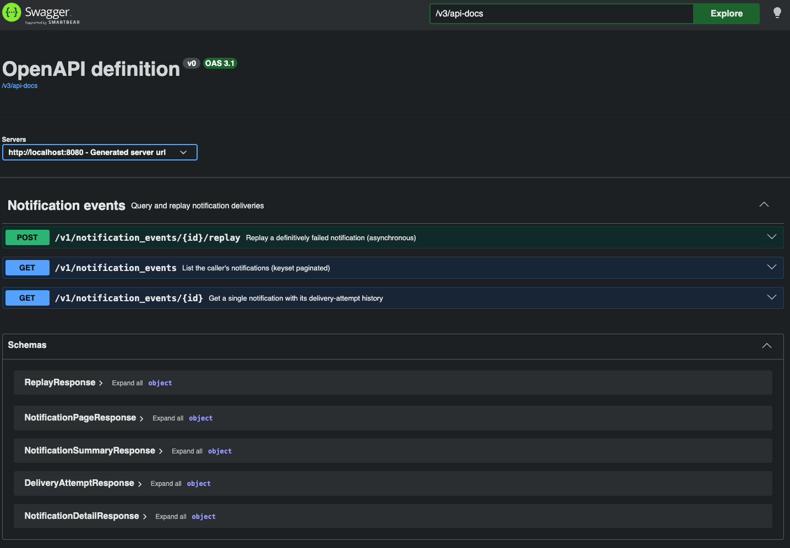
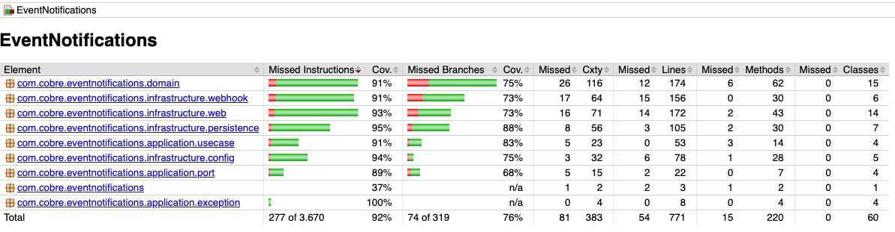
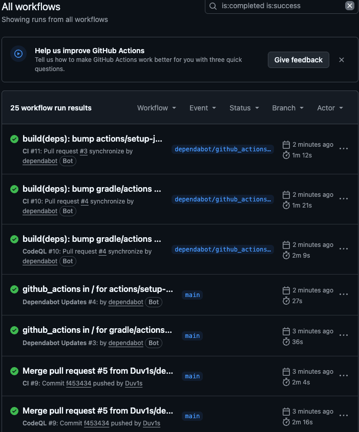
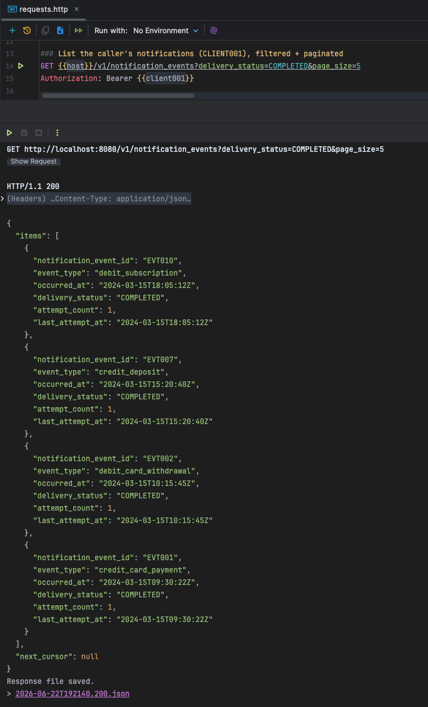
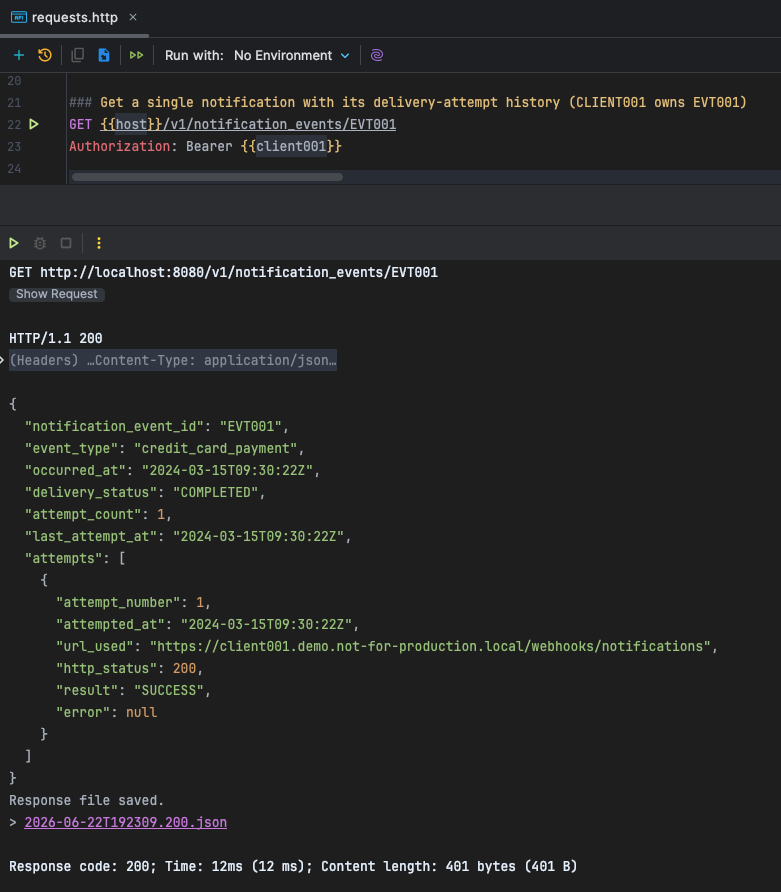
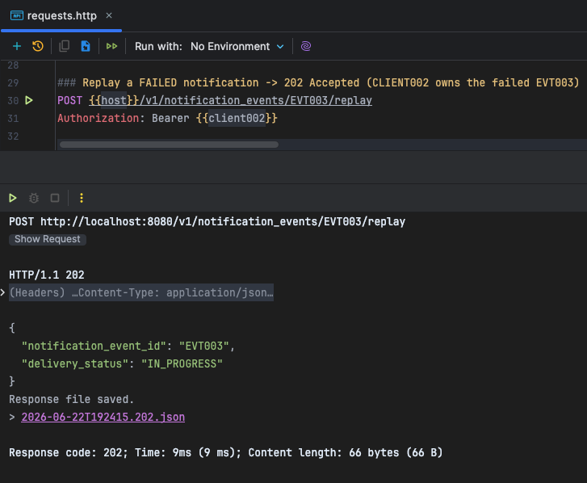
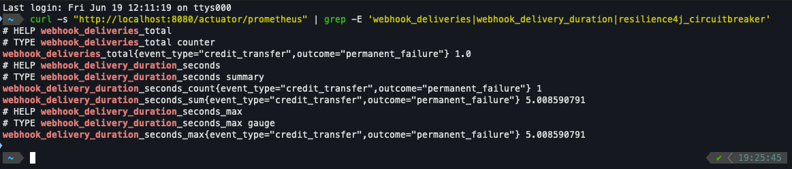

# Event Notifications

A reference implementation of a **self-service event-notification service** for a transactional,
event-driven platform: it delivers platform events to clients over an **HTTPS webhook** and exposes a
**REST API** to query and replay those notifications.

Built with **Java 26 + Spring Boot 4.1**, **hexagonal architecture**, OAuth2 resource-server security,
Resilience4j, and an in-memory reference adapter seeded from `notification_events.json`. It is
vendor-neutral; placeholder hosts such as `api.cobre.example` are not real endpoints.

- **Design:** [`docs/system-design.md`](docs/system-design.md)
- **Decisions (ADRs):** [`docs/adr/`](docs/adr/)
- **Security analysis (OWASP):** [`docs/security.md`](docs/security.md)

## Requirements

- A JDK to run Gradle (21+). The **Java 26 toolchain** used to compile/run is auto-provisioned by the
  Gradle Foojay resolver if it is not already installed.

## Run

```bash
./gradlew bootRun
```

Starts on `http://localhost:8080` with **no setup**: at startup the seed (`notification_events.json`
+ `subscriptions.json`) is loaded into a thread-safe in-memory store. Swagger UI is at
`/swagger-ui.html`, the OpenAPI spec at `/v3/api-docs`.



*Swagger UI: the documented REST API (list, get-by-id, replay) ready to try from the browser.*

## Test

```bash
./gradlew test     # unit + slice + integration tests
./gradlew build    # the above + Spotless formatting check + ArchUnit boundary rules
```

Test coverage (JaCoCo) is generated automatically by `test`; open the HTML report at
`build/reports/jacoco/test/html/index.html` (or run `./gradlew test jacocoTestReport`).



*JaCoCo HTML report after a green `./gradlew test`: per-package instruction and branch coverage.*

### Continuous integration

Three GitHub Actions workflows guard `main` and every pull request:

- **CI** ([`ci.yml`](.github/workflows/ci.yml)) — on each push and PR, runs `./gradlew build` on
  `ubuntu-latest`: it compiles, runs the unit/slice/integration tests, checks formatting (Spotless)
  and enforces the hexagonal boundary rules (ArchUnit), so a broken build, a failing test, bad
  formatting or a crossed architecture boundary blocks the merge. A stable JDK 21 drives Gradle while
  the Java 26 toolchain is auto-provisioned via Foojay.
- **CodeQL** ([`codeql.yml`](.github/workflows/codeql.yml)) — static application security testing
  (SAST) over the Java sources on every push and PR, plus a weekly scheduled scan.
- **Dependabot** ([`dependabot.yml`](.github/dependabot.yml)) — weekly dependency-update PRs for the
  Gradle and GitHub Actions ecosystems; each one is gated by the same CI + CodeQL checks before it can
  merge.



*GitHub Actions filtered to completed + successful runs: `CI` and `CodeQL` green across direct pushes and Dependabot PRs.*

## Authenticate & call the API

`/v1/**` requires an OAuth2 **JWT** (the API is assumed public on the internet). For the demo the
resource server verifies tokens against a **local JWKS** (a test key on the classpath); in production
point it at the IdP via `OAUTH2_JWK_SET_URI`.

Get a demo token (signed with the committed test key; read + replay scopes):

```bash
./gradlew -q printDemoToken                 # client_id = CLIENT001
./gradlew -q printDemoToken --args=CLIENT002 # client_id = CLIENT002
```

Call the API (see [`requests.http`](requests.http) for a ready-to-run collection):

```bash
TOKEN=$(./gradlew -q printDemoToken)

# List the caller's notifications (filter by event date and delivery_status, keyset paginated)
curl -s -H "Authorization: Bearer $TOKEN" \
  "http://localhost:8080/v1/notification_events?delivery_status=COMPLETED&page_size=5"

# Get one notification with its delivery-attempt history
curl -s -H "Authorization: Bearer $TOKEN" \
  "http://localhost:8080/v1/notification_events/EVT001"

# Replay a FAILED notification (CLIENT002 owns the failed EVT003) -> 202 Accepted
TOKEN2=$(./gradlew -q printDemoToken --args=CLIENT002)
curl -s -i -X POST -H "Authorization: Bearer $TOKEN2" \
  "http://localhost:8080/v1/notification_events/EVT003/replay"
```

> In the seed, **CLIENT001's notifications are all `COMPLETED`**; the failed ones eligible for replay
> belong to **CLIENT002** (`EVT003`) and **CLIENT003** (`EVT005`, `EVT009`). Replaying a `COMPLETED`
> notification returns `409`; reading another tenant's notification returns a uniform `404`.

`delivery_status` filter values are the public states `PENDING | IN_PROGRESS | COMPLETED | FAILED`.



*`GET /v1/notification_events`: keyset-paginated list scoped to the caller's `client_id`.*



*`GET /v1/notification_events/{id}`: a single notification with its delivery-attempt history.*



*`POST /v1/notification_events/{id}/replay`: replaying a `FAILED` notification returns `202 Accepted`.*

## Architecture

Hexagonal (ports & adapters):

```
domain/                      framework-free core: Notification, Subscription, DeliveryAttempt, value objects
application/port/            outbound ports (repositories, WebhookClient, DeliveryDispatcher) + query types
application/usecase/         List / Get / Replay / Deliver
infrastructure/web/          REST controllers, DTOs, cursor codec, RFC 7807 errors, rate limiting
infrastructure/persistence/  in-memory adapters + seed loader (JPA/PostgreSQL in production)
infrastructure/webhook/      RestClient delivery: CloudEvents, HMAC, SSRF guard, Resilience4j
infrastructure/config/       Spring wiring, security, async dispatch
```

`domain` and `application` stay free of Spring/Jackson/infrastructure; an **ArchUnit** test
(`HexagonalArchitectureTest`) fails the build if that boundary is crossed. Full rationale and the
production (Kafka + PostgreSQL + Outbox) target are in [`docs/system-design.md`](docs/system-design.md).

## Observability

Intentionally minimal: Actuator `/actuator/health` (liveness/readiness), `/actuator/info`,
`/actuator/prometheus` (Micrometer). Delivery metrics (`webhook.deliveries`,
`webhook.delivery.duration`) are tagged only by `outcome`/`event_type`; circuit-breaker metrics are
published too. Logs are ECS-structured JSON with `trace_id`/`client_id`/`event_id` in the MDC and no PII.



*`/actuator/prometheus`: delivery counters/timers and Resilience4j circuit-breaker gauges scraped by Micrometer.*

## Docker

```bash
docker build -t event-notifications .   # multi-stage; requires Java 26 base images
# or, without a Dockerfile:
./gradlew bootBuildImage
```

## Demo caveats

1. **Replay ends in `RETRYING`, not `COMPLETED`.** The seed webhook URLs are unresolvable
   `*.demo.not-for-production.local` placeholders, so a live replay exhausts the in-process retries
   and lands in `RETRYING` (correct for the two-scale model — in production the spaced/distributed
   retry would advance it; that part is design-only here). To see a replay reach `COMPLETED`, point a
   subscription at a reachable **public HTTPS** endpoint by overriding `SUBSCRIPTIONS_SEED` (a *local*
   endpoint is blocked by the SSRF guard).
2. **Observability is deliberately minimal** (Actuator + a couple of metrics + JSON logs). The
   production stack (Prometheus/Grafana, OpenTelemetry, alerting) is described in the design doc only.