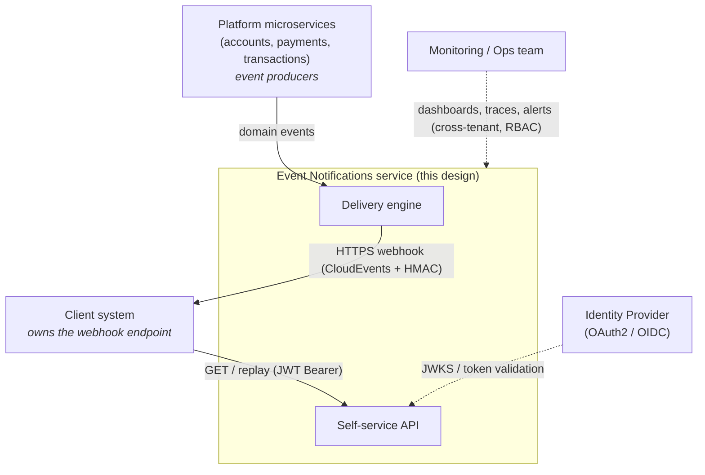
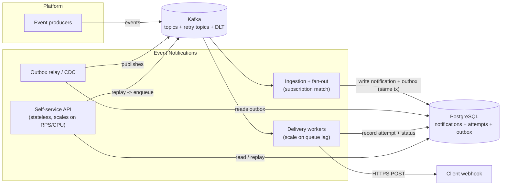
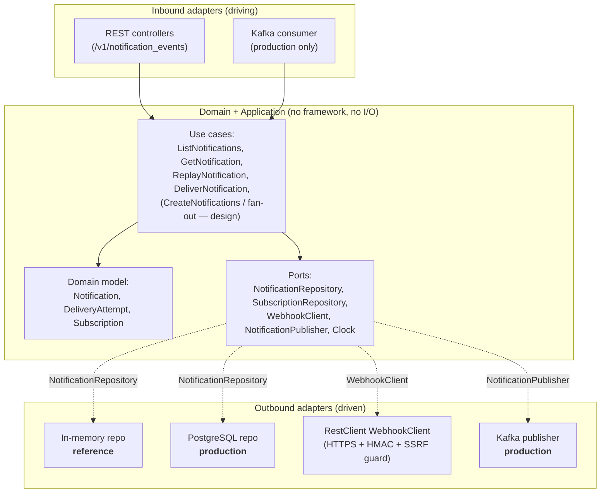
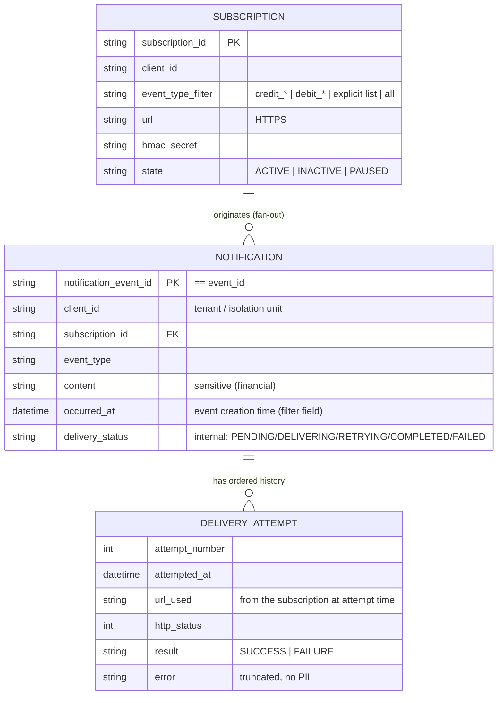
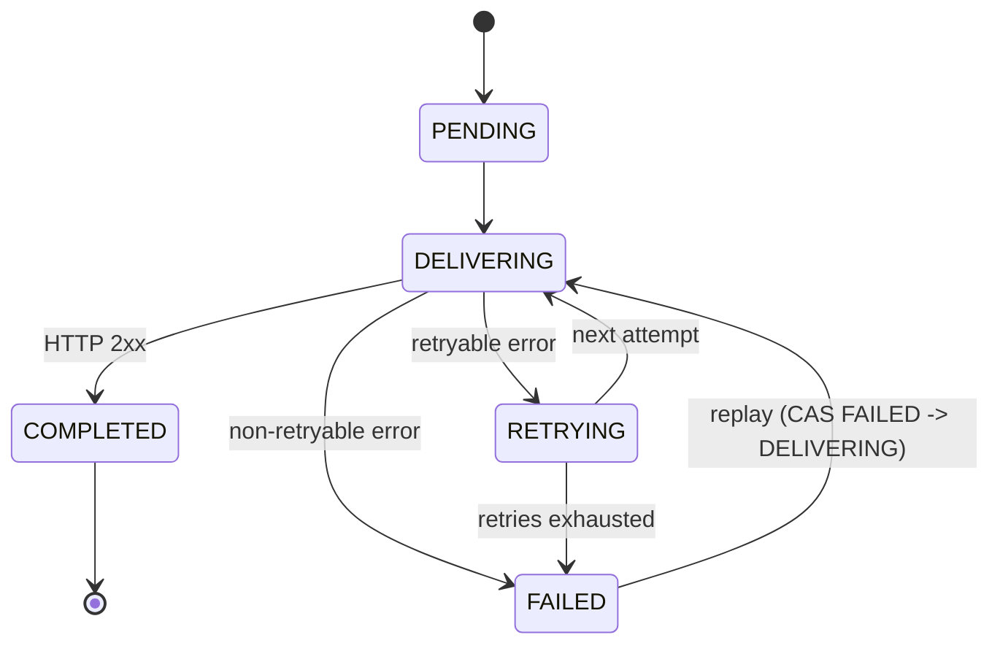
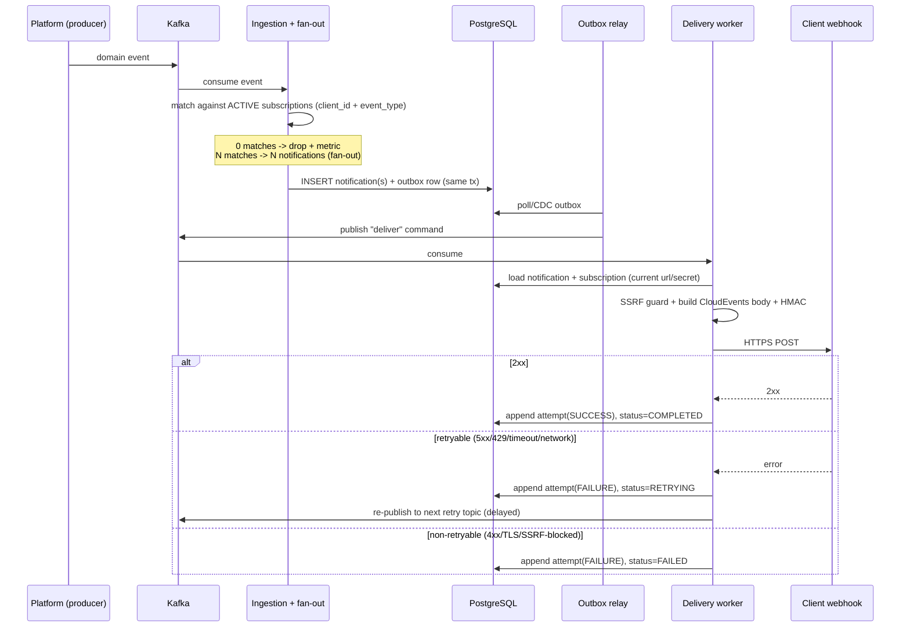
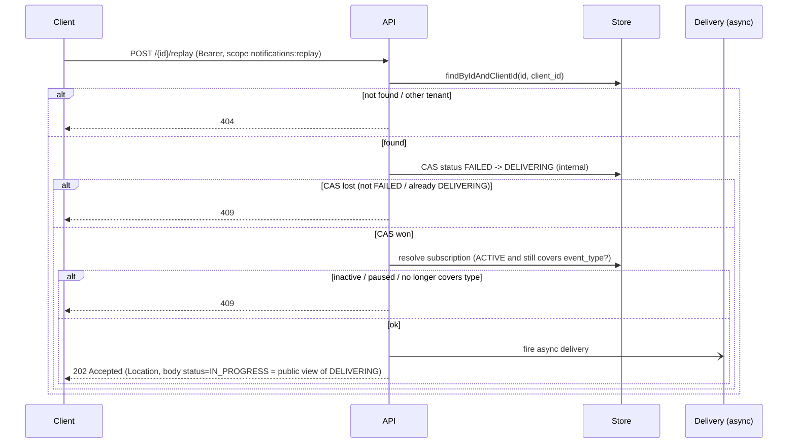
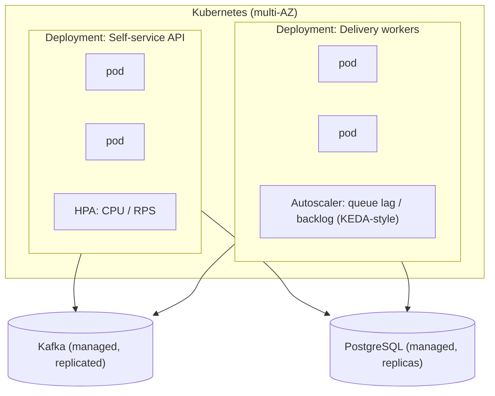

# System Design — Event Notifications

> **Task 1 — System Design.** This document describes the end-to-end design for two capabilities:
> (1) the **delivery of event notifications** (the delivery engine) and (2) the **event notification
> self-service API**. It is written to be vendor-neutral: it names open, standard technologies
> (Kafka, PostgreSQL, Kubernetes) but does not tie the design to any specific cloud provider or
> internal platform. "Cloud-native" here is an architectural style, not a vendor.

**Related documents**
- [`docs/security.md`](./security.md) — Task 3 (OWASP analysis and mitigations).
- [`docs/adr/`](./adr/) — one short ADR per key decision (context, decision, rejected alternatives, consequences).

---

## 1. Problem statement

A transactional, event-driven, microservices platform manages resources for its clients (accounts,
payments, transactions). When the platform generates an event for a client (e.g. a balance update),
the client must be notified through a **webhook** delivered over **HTTPS** to a URL the client owns.

This service is **not the owner of the events** — the platform produces them; this service only
**delivers** them and lets clients **query** their notifications.

The solution must:

| # | Capability | Where it is addressed |
|---|------------|-----------------------|
| 1 | Decide, **via subscription**, whether an event must be delivered | section 4, section 5 |
| 2 | Ensure each client only receives **its own** events | section 4, section 8 |
| 3 | Deliver the notification to the specified URL over HTTPS | section 5 |
| 4 | Handle errors with an **efficient retry strategy** | section 5.4 |
| 5 | **Store the final delivery information** | section 7 |
| 6 | Provide **near real-time observability** | section 8.3 |
| 7 | Self-service **REST API** to list / get / replay notifications | section 6 |

Design drivers: **scalability** and **resiliency**.

---

## 2. Scope: what is designed vs. what is implemented

This is deliberate, because the reference implementation (Task 2) is the *consumer* slice, while this
document covers the full distributed system.

| Concern | Reference implementation (Task 2) | Production target (this design) |
|--------|-----------------------------------|---------------------------------|
| Self-service API (3 endpoints) | ✅ Implemented | ✅ |
| Webhook delivery mechanism | ✅ Real HTTPS client + HMAC + Resilience4j (in-process retries, circuit breaker, timeouts) | ✅ |
| Persistence | In-memory adapter (thread-safe), seeded from `notification_events.json` | PostgreSQL adapter |
| Eventing / async delivery & spaced retries | Out of scope — replay runs `@Async` in-process; no fake broker | Kafka + retry topics + DLT + scheduler |
| Event ingestion / fan-out (the *producer*) | Out of scope (ports are in place to add it) | ✅ |
| Subscriptions CRUD | Out of scope — assumed pre-existing behind a port | ✅ (separate bounded context) |

**Key coherence point (hexagonal architecture):** the reference implementation and the production
target differ **only by adapter**. The same domain ports (`NotificationRepository`,
`SubscriptionRepository`, `WebhookClient`, …) are satisfied by an in-memory adapter today and by
PostgreSQL/Kafka/Outbox adapters in production — **the domain does not change**. See section 3.3 and section 11.

---

## 3. Architecture

### 3.1 C4 — System context



### 3.2 C4 — Containers (production target)



### 3.3 Hexagonal architecture (ports & adapters)

The core domain is isolated behind ports. **Inbound** adapters drive the application; **outbound**
adapters are driven by it. The diagram makes the section 2 coherence point explicit: every outbound port has
a reference adapter (in-memory / real HTTP) and a production adapter.



**Architectural invariant enforced by tests (ArchUnit):** the domain/application layer must not
depend on Spring, Jackson, the persistence adapter, or any I/O type. Adapters depend on ports, never
the reverse.

---

## 4. Domain model

We model a single aggregate, **`Notification`**, because this service does not own the event. The
event's data is embedded in the notification; there is no separate `Event` entity. **`Subscription`**
is a first-class concept consulted at delivery time, and **`DeliveryAttempt`** is a first-class child
that provides the audit trail and satisfies *"store the final delivery information"*.



### 4.1 Relationships and invariants

- **Event → Notification is 1:N** conceptually (one notification per active matching subscription —
  *fan-out*). In the provided dataset it is **1:1**, which the implementation keeps.
- A notification **persists the `subscription_id`** that originated it (assigned at seed time for the
  dataset; documented as an assumption since the source JSON does not carry it). This makes the
  notification a self-contained audit record and makes **replay deterministic** (it targets exactly
  one subscription).
- **URL and secret are resolved from the *current* subscription** (looked up by id) at every
  attempt — never from a stale snapshot. If a client fixed its endpoint, replay must reach the new
  one. The **URL actually used** is recorded per attempt for audit.
- `client_id` is the **isolation unit** and the API consumer; a client has **1:N** subscriptions.

### 4.2 State machine



- **Single terminal failure state: `FAILED`** = retries exhausted, definitive, **replay-eligible**.
  There is no separate `DEAD`/`EXHAUSTED` state — the transient condition is captured by `RETRYING`,
  not by a variant of `FAILED`. The dataset's `failed` maps directly to `FAILED` (we assume automatic
  retries were exhausted before the data was loaded).
- **Internal vs. public states.** Internal states are `PENDING, DELIVERING, RETRYING, COMPLETED,
  FAILED`. The API exposes `PENDING, IN_PROGRESS, COMPLETED, FAILED` — `DELIVERING` and `RETRYING`
  both map to `IN_PROGRESS` **at the edge (DTO)**, so the retry mechanics can evolve without breaking
  the API contract.

### 4.3 Timestamps

| Field | Meaning | Notes |
|-------|---------|-------|
| `occurred_at` | When the event happened | **Filter field** for the API. Seeded from `delivery_date` because the source has no real event time (documented assumption). |
| `delivery_date` / `last_attempt_at` | Timestamp of the **last** attempt | Success time if `COMPLETED`, last failure time if `FAILED`. Derived from the attempt list. |
| `created_at` | When the notification was created | Optional; collapses with `occurred_at` for this dataset. |

Counters (`attempt_count`, `last_attempt_at`, `last_error`, `last_url`) are **derived** from the
ordered `DeliveryAttempt` list; they are not stored as duplicated truth.

---

## 5. Delivery of event notifications (the engine)

### 5.1 End-to-end flow (production)



### 5.2 Subscription matching and fan-out

- Matching is by `client_id` + `event_type` against **ACTIVE** subscriptions, using the
  `credit_*` / `debit_*` pattern, an explicit list, or "all".
- **Fan-out** at creation: one notification per matching active subscription (each carries its
  `subscription_id`). The design supports N; the dataset yields 1.
- **0 matches at creation** → nothing is delivered, a metric is recorded.
- We do **not** enforce a "one subscription per (client, type)" invariant.

### 5.3 Webhook contract

**Body — CloudEvents 1.0** (CNCF standard for event-driven systems; preferred over a bespoke format):

```json
{
  "specversion": "1.0",
  "id": "EVT003",
  "source": "/platform/notifications",
  "type": "credit_transfer",
  "time": "2024-03-15T11:20:18Z",
  "client_id": "CLIENT002",
  "datacontenttype": "application/json",
  "data": { "content": "Bank transfer received from Account #4567 for $1,500.00" }
}
```

`data.content` carries financial data; it is **not minimized** (it is the client's own data going to
the client's own endpoint) but it is treated as **sensitive**: never logged, redacted in logs/traces.
Confidentiality in transit is provided by HTTPS; integrity and authenticity by the HMAC signature.

**Headers**

| Header | Value | Purpose |
|--------|-------|---------|
| `X-Signature` | `t=<unix_ts>,v1=<hex_hmac>` | HMAC-SHA256 over `timestamp + "." + body`. `t` is bound to the signature (anti-replay). `v1` versions the scheme and enables **secret rotation** (dual signatures during rotation). |
| `X-Event-Id` | `notification_event_id` (== the CloudEvents body `id` == `event_id`) | The stable dedup key, mirrored in a header so the receiver can deduplicate without parsing the body. **Stable across retries and replays** and tied to the notification, never generated per send. |
| `X-Delivery-Attempt` | attempt number | Informational. |

The receiver is asked (documented contract) to enforce a **~5 min timestamp tolerance** and to be
**idempotent**, ordering by `occurred_at + event_id` rather than arrival order (delivery is
**at-least-once**, with **no ordering guarantee**).

**Transport / SSRF guard** — validated on **every delivery** (authoritative; validation at
subscription-creation time exists too but is described in design only, because DNS can change later):

- **HTTPS and port 443 only** (reject `http://`, other schemes/ports).
- **Block** loopback / private / link-local / metadata ranges: `127/8`, `10/8`, `172.16/12`,
  `192.168/16`, `169.254.0.0/16` (incl. `169.254.169.254`), `0.0.0.0/8`, `::1`, `fc00::/7`,
  `fe80::/10`, and the IPv4-mapped-IPv6 range `::ffff:0:0/96` (common bypass).
- **Resolve DNS, validate all resolved IPs, and connect to the validated IP (pinning)** to close the
  DNS-rebinding window (no re-resolution at connect time).
- **No redirects** (following a client-controlled redirect is an SSRF risk → treated as a
  non-retryable configuration failure).
- **TLS 1.2+** (1.3 preferred); certificate verification **always on** (invalid/expired/self-signed
  → non-retryable). Response body is read with a **size cap (~64KB)**; a truncated fragment is stored
  in the attempt for diagnostics, but **success is decided solely by a 2xx status**.

### 5.4 Retry strategy — one strategy, two time scales

The same exponential-backoff-with-jitter strategy applies at two scales. The in-process scale is what
the reference implementation demonstrates; the design elevates it to a spaced, distributed scale.
**Spaced retries never run in-process** — a thread cannot block for hours; that is the
scheduler/broker's job.

| Aspect | In-process (reference impl, Resilience4j) | Spaced / distributed (design) |
|--------|-------------------------------------------|-------------------------------|
| Max attempts | 4 | ~6–8 |
| Backoff | 500 ms × 2ⁿ, cap 5 s | 1 min × 2ⁿ, cap ~1 h |
| Jitter | **Full jitter** | **Full jitter** |
| Total window | seconds | ~24 h, then `FAILED` → DLT |
| Timeouts | connect 2 s / read 5 s | same |
| Mechanism | retry within one invocation | Kafka **retry topics** (staggered delays) + **dead-letter topic** |

**Full jitter** (not equal jitter) is chosen to better avoid thundering-herd when many endpoints fail
and recover together.

**Retryable vs. non-retryable**

- **Retryable:** network/connection errors, timeouts, `5xx` (500/502/503/504), `429` (respecting
  `Retry-After` on 429/503, with a max cap).
- **Non-retryable (immediate failure):** `4xx` client errors (400/401/403/404/410/422), invalid TLS,
  SSRF-blocked URL. **Success = 2xx only**; `3xx` are not followed.
- *Design option:* after repeated permanent failure (e.g. `410`), auto-pause the subscription.

Why Kafka needs retry topics: Kafka has no native delayed delivery. Staggered retry topics
(`deliver.retry.1m`, `deliver.retry.5m`, …) with a consumer that respects the delay model the
spaced backoff; exhausted messages land in the **DLT**. A broker with native delay (RabbitMQ
delayed-exchange / TTL+DLX, or a managed queue with delay + DLQ) would simplify scheduling but at the
cost of throughput and per-client ordering — see [ADR: broker choice](./adr/).

**Ordering trade-off (intentional, not a contradiction).** Partitioning by `client_id` gives
per-partition ordering *on the happy path*. Moving a failed message to a delayed retry topic
**deliberately gives up strict ordering**: the failed event is re-attempted later while newer events
for the same client may be delivered first. We accept this on purpose — it prioritizes overall
delivery progress and isolates a single bad event instead of head-of-line-blocking the whole client's
stream behind it. This is precisely why the contract is **at-least-once with no ordering guarantee**
(section 5.3) and the receiver is asked to be idempotent and to order by `occurred_at + event_id`
rather than by arrival order. The per-partition ordering mentioned in section 9.1 is therefore a
best-effort happy-path property, not a guarantee.

**Reference-implementation limitation — `RETRYING` is a dead-end in the demo.** When the in-process
retries are exhausted on a *retryable* failure, the notification transitions to `RETRYING`
(`IN_PROGRESS` publicly). This is correct for the two-scale model: in production the spaced retry
would later advance it to `COMPLETED`, or after the 24 h window to `FAILED` → DLQ. That spaced retry
is **design-only**, so in the reference implementation a persistently-retryable delivery stays in
`RETRYING` — nothing advances it, and `replay` requires `FAILED`. For a satisfying happy-path demo,
point a subscription at a reachable **public HTTPS** endpoint (the SSRF guard blocks loopback/private
hosts, so a *local* endpoint will not work) by overriding `SUBSCRIPTIONS_SEED` with a subscriptions
file whose `url` is deliverable; the bundled seed URLs are intentionally non-resolving placeholders.

### 5.5 Failure isolation

- **Circuit breaker per destination** (per subscription/host), never global — a global breaker would
  let one dead endpoint stop delivery for everyone. Implemented with a Resilience4j breaker
  **registry keyed by destination**.
- **Bulkheads per destination** (design): cap concurrent calls per endpoint so one slow endpoint
  cannot exhaust the worker pool.
- **DLT** on exhaustion; **alerts** when a notification reaches `FAILED` or a breaker opens.
- The **self-service `replay`** is the official recovery mechanism from `FAILED` (and from the DLT in
  production).

---

## 6. Self-service API

All endpoints are versioned under `/v1`. Errors use **RFC 7807** (`application/problem+json`),
centralized in a `@RestControllerAdvice`, with `type/title/status/detail/instance` plus an
application `code` and `errors[]` for validation failures.

The **caller's `client_id` always comes from the token claim**, never from a loose parameter
(anti-BOLA). The API is **strictly self** — every request is scoped to that one client.

### 6.1 `GET /v1/notification_events`

Lists the caller's notifications.

- **Filters:** `occurred_from` / `occurred_to` (half-open `[from, to)`, ISO-8601) on `occurred_at`
  (the *event creation date*, not the delivery date); `delivery_status` accepts **multiple** values
  validated against the public enum (`PENDING|IN_PROGRESS|COMPLETED|FAILED`; unknown → `400`).
- **Pagination: keyset/cursor.** An opaque base64 cursor encoding `(occurred_at, id)`; deterministic.
  `page_size` default 20, max 100. Response includes `next_cursor` (null when exhausted). Keyset is
  chosen over offset because it stays stable and cheap under inserts at scale.
- **Order:** `occurred_at DESC, id` (the `id` tiebreaker is required for the keyset).
- **List item DTO (summary):** `id, event_type, occurred_at, delivery_status, attempt_count,
  last_attempt_at` — **no attempt history** (that is detail-only).

### 6.2 `GET /v1/notification_events/{id}`

- **404 uniform** whether the notification does not exist or belongs to another client — existence is
  not revealed (anti-enumeration / BOLA). Internally the difference is logged for audit. Implemented
  as `findByIdAndClientId` returning empty → 404, so the two cases never branch on existence.
- The detail includes the **full ordered `DeliveryAttempt` history** (number, timestamp, URL used,
  HTTP status, result, truncated error).

### 6.3 `POST /v1/notification_events/{id}/replay`

Re-delivers a notification whose delivery has **definitely failed**.



- **`202 Accepted` + async** (in-process `@Async`, bounded executor; `Location` header to re-query the
  detail). Nothing synchronous — a synchronous call would hold the connection open during backoff.
- **Concurrency:** a synchronous **compare-and-set `FAILED → DELIVERING`** (the internal state; the
  API surfaces it as `IN_PROGRESS`) happens *before* returning `202`. The winner fires the async
  delivery; a loser (already `DELIVERING`/`RETRYING`, or not in `FAILED`) gets **409**.
- **Eligibility:** replay only from `FAILED`. Any other internal state (`PENDING` / `DELIVERING` /
  `RETRYING` / `COMPLETED`) → `409`. The
  subscription must be **ACTIVE and still cover the `event_type`** (the filter may have changed); if
  not → `409` (re-delivering something the client no longer wants is worse than not delivering). URL
  and secret come from the **current** subscription.
- **`Idempotency-Key`** (optional request header) deduplicates retries of the same POST (covers
  "I don't know if my first request arrived"); the CAS already covers the core race.
- Replay of another tenant's notification → **404** (same as section 6.2).

### 6.4 Status-code matrix

| Endpoint | 200 | 202 | 400 | 401 | 403 | 404 | 409 | 429 |
|----------|-----|-----|-----|-----|-----|-----|-----|-----|
| `GET /notification_events` | ✅ | | invalid filter/cursor | no/invalid token | missing scope | | | rate limit |
| `GET /{id}` | ✅ | | | ✅ | missing scope | not found / other tenant | | rate limit |
| `POST /{id}/replay` | | ✅ | | ✅ | missing scope | not found / other tenant | not FAILED / already delivering / subscription not eligible | rate limit |

---

## 7. Data and persistence

**PostgreSQL** is the primary store. Self-service queries are relational (`client_id` + `occurred_at`
range + `status`), which Postgres serves well.

- **Indexing:** composite index `(client_id, occurred_at, id)` to serve the keyset list directly;
  partial indexes per `status` where useful.
- **Payload:** `JSONB` for `content` / event data.
- **Partitioning:** by time (e.g. monthly on `occurred_at`) to support retention and cheap pruning.
- **Retention:** ~90 days **hot** (queryable by the API) + archival to cold storage for audit
  (configurable).

**Outbox pattern (yes).** The notification (and any status change) and its outbox row are written in
the **same transaction**; a relay (CDC such as Debezium, or a poller) publishes to the broker. This
removes the dual-write problem and gives **at-least-once publication consistent with the database**.

**CQRS (no).** The same store serves reads and writes; if read traffic grows, add **read replicas**
rather than a separate read model — the query shapes do not justify the added complexity.

**Rejected alternative:** NoSQL (Cassandra/Dynamo, partitioned by `client_id`) as a future scale-out
option. Rejected now because the queries are relational and the volume does not justify it. See
[ADR: persistence](./adr/).

---

## 8. Cross-cutting concerns

### 8.1 Authentication, authorization, multitenancy

- **AuthN:** OAuth2 / OIDC **JWT Bearer** (client-credentials grant), validated as a Spring Security
  **resource server** against JWKS. Stateless → horizontal scale. The reference implementation
  validates real JWTs (signature, `iss`, `aud` = this API, `exp`/`nbf`) using a test issuer/JWKS;
  validation is never disabled.
- **Tenant claim:** the business tenant travels in a dedicated **`client_id`** claim (= `CLIENT001…`),
  **not** in `sub` — the OAuth client (the app) is not the business tenant. A token without that
  claim → `401`.
- **AuthZ:** two scopes — `notifications:read` (list/detail) and `notifications:replay` (replay).
  Replay changes state and triggers outbound work, so it earns its own least-privilege scope, enforced
  at method level (`@PreAuthorize`).
- **Isolation, defense-in-depth at the type level:** the read port **always** requires a `ClientId`
  (`findByIdAndClientId`, `findByClientId`); **no `findById` without a tenant exists** in the domain,
  so a cross-tenant read is structurally impossible. `ClientId` is passed explicitly from use case to
  port (not hidden in a `ThreadLocal`/`SecurityContext` deep in the stack), which keeps it testable.

### 8.2 Rate limiting

Two **orthogonal axes** — do not conflate them:

- **Tiers (what is limited): per operation.** Reads are generous (~100/min per client); replay is
  strict (~10/min per client) because it triggers outbound deliveries. Over-limit → `429` +
  `Retry-After` + `RateLimit-Limit/Remaining/Reset`.
- **Layers (where it is enforced):** the **gateway / API management** in production, plus a
  lightweight **Bucket4j** token bucket (in-app, per client) as a **backstop**.

Maps to OWASP API4:2023 *Unrestricted Resource Consumption* (see [`security.md`](./security.md)).

### 8.3 Observability (near real-time)

Intentionally minimal in the reference implementation; expanded in one paragraph for production.

- **Reference impl:** Spring Boot Actuator — `/actuator/health` (liveness/readiness) and
  `/actuator/prometheus` (Micrometer). A small metric set: a **delivery counter by result**
  (success/failure) and a **delivery-latency timer/histogram**. Resilience4j **circuit-breaker
  metrics** come for free via Micrometer. **Metrics are not tagged by `client_id`/`subscription_id`**
  (cardinality); per-client breakdown lives in logs/traces. **Structured JSON logs** carry `trace_id`
  + correlation ids (`client_id`, `event_id`) and **no PII**.
- **Production (design):** Prometheus + Grafana dashboards and a couple of basic alerts (spike in
  delivery failures, circuit breaker open); distributed tracing (OpenTelemetry) spanning inbound API →
  outbound delivery; log aggregation. SLO-style alerting on delivery success rate, p99 latency, DLT
  growth, and throughput drops (behavioral deviation).

### 8.4 Monitoring / Ops team access

The monitoring team's need (spot deviations, answer client complaints) is met by **cross-tenant
observability with RBAC** — dashboards, traces (correlated by `client_id` + `event_id` + `trace_id`),
and searchable logs (no PII) — and, **optionally, a separate internal admin API**
(`notifications:admin`, its own audience/scope), **described in design only**. It is **never** served
through the self-service API, which stays strictly self.

---

## 9. Scalability and resiliency

### 9.1 Scale assumptions (orders of magnitude, not false precision)

| Dimension | Assumption |
|-----------|-----------|
| Clients | ~1M |
| Active subscriptions | ~1.5M |
| Event rate | ~2k/s average, ~20k/s peak |
| Delivery SLA | p99 < ~5 s from event to first attempt (normal conditions) |
| Delivery success | ≥ 99.x% within the 24 h retry window |
| Retention | 90 days hot (API-queryable) + cold archive for audit |

**How the numbers justify the design:**

- **~20k/s peak** and the need for replay → an event log backbone (**Kafka**), **partitioned by
  `client_id`** (best-effort per-partition ordering on the happy path — intentionally relaxed by the
  retry topics, see section 5.4; parallelism scales with partitions).
- **1M clients × 90-day history** → **time-partitioned PostgreSQL** with cheap pruning and a hot/cold
  retention split; the `(client_id, occurred_at, id)` index keeps per-client queries fast.
- **Bursty failures of independent endpoints** → per-destination circuit breakers + bulkheads + full
  jitter so one client's outage cannot degrade others.

### 9.2 Deployment topology



- **Two stateless deployments that scale on different signals**, isolated so delivery load cannot hurt
  API latency and vice versa (**bulkhead at the deployment level**):
  - **Self-service API** → HPA on CPU/RPS.
  - **Delivery workers** → autoscaling on **queue lag/backlog** (KEDA-style).
- **Multi-AZ** for availability; **managed broker and PostgreSQL with replicas**.

### 9.3 Resiliency summary

| Risk | Mitigation |
|------|-----------|
| Client endpoint down/slow | Per-destination circuit breaker + bulkhead + retries with full jitter |
| Transient delivery error | In-process retries → spaced retry topics → DLT |
| Lost publish (dual-write) | Outbox + relay/CDC (at-least-once, consistent with DB) |
| Duplicate delivery | `X-Event-Id = event_id`; receiver deduplicates |
| Thundering herd on recovery | Full jitter backoff |
| Hot partition | Partition by `client_id`; workers scale on lag |
| Data growth | Time-partitioned tables + hot/cold retention |
| Permanent failure visibility | DLT + alerts + self-service replay |

---

## 10. Technology choices and rejected alternatives

| Choice | Selected | Rejected alternative & why |
|--------|----------|----------------------------|
| Language/runtime | Java 26 + Spring Boot 4.1 (Spring Framework 7.0.x) | — (challenge constraint) |
| Architecture | Hexagonal (ports & adapters) | Layered — weaker isolation, harder to swap adapters |
| HTTP client | `RestClient` behind `WebhookClient` port | Stub-only — would not prove real HTTPS/HMAC/timeouts |
| Resilience | Resilience4j **`resilience4j-spring-boot4` 2.4.0** (retry, breaker, timeout) | Hand-rolled retries — error-prone, no breaker. **Note:** the `-spring-boot3` starter does **not** work on Boot 4 — Boot 4 support landed in 2.4.0 via the dedicated `-spring-boot4` module |
| API docs | springdoc-openapi **3.0.x** (`springdoc-openapi-starter-webmvc-ui`) | The 2.8.x line is Boot 3 only; the 3.0.x line is the first to support Spring Framework 7 / Boot 4 |
| Broker | Kafka (partition by `client_id`, retry topics, DLT) | Delay-native broker (RabbitMQ/managed queue) — simpler scheduling, lower throughput, weaker per-client ordering |
| Store | PostgreSQL (indexed, JSONB, time-partitioned) + Outbox | NoSQL — queries are relational; volume doesn't justify it |
| Read path | Same store + read replicas | CQRS read model — unjustified complexity |
| Webhook payload | CloudEvents 1.0 | Bespoke format — reinvents a standard |
| Signature | HMAC-SHA256 over `ts.body`, versioned header | Sign body only — leaves timestamp unauthenticated |
| AuthN | OAuth2 resource server (JWT, JWKS) | API keys — no expiry/scopes; mTLS — design-only extra layer |
| Pagination | Keyset/cursor | Offset/limit — unstable & costly at scale |

> **Spring Boot 4 dependency compatibility (validated).** Boot 4 sits on Spring Framework 7 /
> Jakarta EE 11, which breaks starters built for Boot 3. The two third-party libraries this design
> relies on do support Boot 4, but only on specific artifacts/versions: **Resilience4j** via
> `io.github.resilience4j:resilience4j-spring-boot4:2.4.0` (not `-spring-boot3`) and **springdoc**
> via `org.springdoc:springdoc-openapi-starter-webmvc-ui:3.0.x`. This was verified empirically by
> resolving the runtime classpath against Boot 4.1.0 — both align cleanly on Spring Framework 7.0.8
> with no conflicts.

---

## 11. Reference implementation ↔ production target (port mapping)

The same domain runs in both worlds; only the adapter behind each port changes. **The domain code is
identical.**

| Port | Reference adapter (Task 2) | Production adapter |
|------|---------------------------|--------------------|
| `NotificationRepository` | In-memory (`ConcurrentHashMap`), seeded from `notification_events.json` | PostgreSQL (JPA), time-partitioned |
| `SubscriptionRepository` | In-memory seed (`client_id → url + secret + filter + state`) | Subscriptions bounded context |
| `WebhookClient` | `RestClient` (real HTTPS + HMAC + SSRF guard + Resilience4j) | Same adapter, production config |
| `NotificationPublisher` | Not used (replay runs `@Async` in-process) | Kafka publisher (+ Outbox relay) |
| Inbound driver | REST controllers | REST controllers **+** Kafka consumer (ingestion/fan-out) |

This is the concrete payoff of hexagonal architecture: the reference implementation is the production
system with the in-memory and in-process adapters swapped in, behind unchanged ports.

---

## 12. Out of scope / future work

- **Producer path** (event ingestion → subscription match → fan-out → create) — ports are in place;
  add a Kafka-consumer inbound adapter and a `CreateNotifications` use case.
- **Subscriptions CRUD** — a separate bounded context; here it is read-only behind a port.
- **Admin / monitoring API** (`notifications:admin`) — cross-tenant, RBAC-gated; design only.
- **Secret rotation automation** and **mTLS to receivers** for high-security clients.

---

## 13. ADR index

Each key decision is captured as a short ADR under [`docs/adr/`](./adr/) (context, decision, rejected
alternatives, consequences):

1. Hexagonal architecture (ports & adapters).
2. `Notification` as the single aggregate (no separate `Event` entity).
3. `Subscription` behind a port; CRUD out of scope.
4. `delivery_date` as a proxy for `occurred_at`.
5. Replay only from `FAILED`.
6. At-least-once + HMAC; receiver dedups by outbound `X-Event-Id` (= `event_id`); replay POST accepts the standard inbound `Idempotency-Key`.
7. SSRF guard on every delivery.
8. OAuth2 resource server + tenancy enforced at the port.
9. Two-scale retry strategy with Resilience4j.
10. Minimal observability.
11. Kafka backbone with retry topics + DLT.
12. PostgreSQL + Outbox; no CQRS.